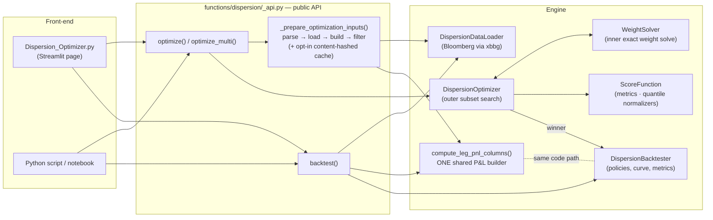
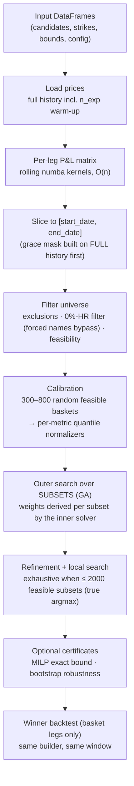
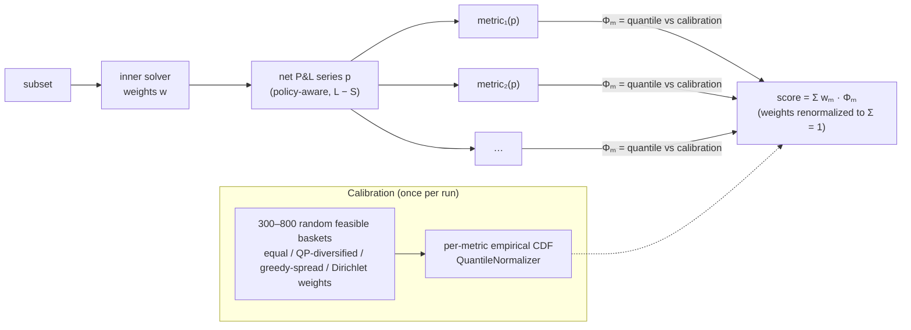
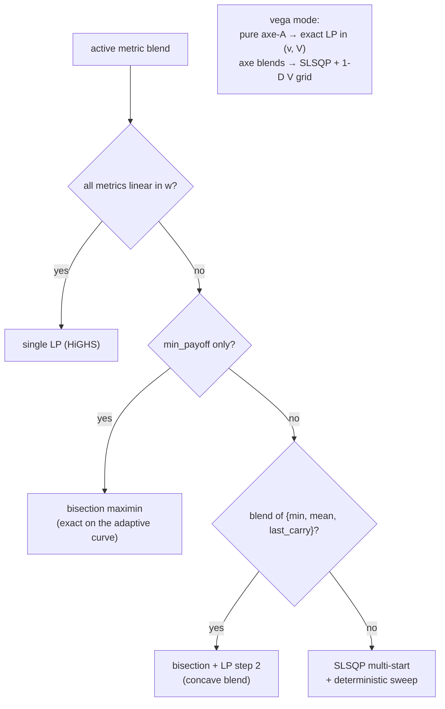
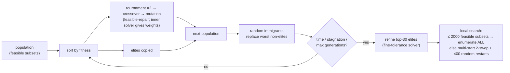

# Dispersion Engine — Architecture & Reference

Selection, weighting and backtesting of variance / vol-swap dispersion baskets
(mono-corridor and cross-corridor), driven either headless from Python or
through the Streamlit page. The page is a thin front-end: every computation
routes through `functions/dispersion/_api.py`.

---

## 1. Architecture



Both the optimizer's scored P&L matrix and the delivered backtest are produced
by the **same builder** (`compute_leg_pnl_columns`), so scored and delivered
results cannot drift apart. This equality is asserted by tests, not assumed.

### Naming convention

Names follow the **role**, never the asset class (the class is only the usual
case; the role never flips). The authoritative glossary lives at the top of
`_backtester.py`.

| Term | Usually | Role |
|---|---|---|
| **Variance Asset** → series `variance_px` | the index (`HSCEI Index`) | underlies the **cross leg** (index variance inside the stock's corridor); the traded name itself in mono mode |
| **Corridor Condition Asset** → series `corridor_px` | the stock (`005930 KP Equity`) | underlies the **mono leg**, defines the corridor for both legs, and is the **per-name key** (P&L column, forced tickers, vega) |
| `pnl_mono` / `pnl_cross` | — | the two sub-legs; **leg P&L = (mono − cross) × 100** |
| `Long Leg` / `Short Leg` | — | **basket** sides (short = sold legs, always subtracted); never mono/cross |

### Units

Public DataFrames carry percentages (`Strike Mono Var Swap (%)` = 21.4,
`Min/Max Weight` = 5.0); internal objects (`DispersionLeg`, constraints,
results) carry decimals. All conversions happen in `_api.py`, nowhere else.

---

## 2. The algorithms, in brief

Each stage uses the cheapest standard tool that is **exact** for its problem
class. The map first, then each tool in a few lines:

| Problem | Tool | Where |
|---|---|---|
| Choose the subset of names (combinatorial, non-convex) | GA + local search — exhaustive enumeration when the universe is small | `_optimizer.py` |
| Weights for a given subset, linear objective | LP (HiGHS) | `scoring/weight_solver.py` |
| Weights maximizing the worst day | bisection on LP feasibility | `scoring/weight_solver.py` |
| Weights for non-smooth blends (hit ratio, drawdown, CVaR…) | SLSQP multi-start + deterministic sweep | `scoring/weight_solver.py` |
| Diversified calibration draws | QP | `_optimizer.py` |
| Put all metrics on one scale | empirical CDF (quantile rank) | `scoring/normalizers.py` |
| Prove the maximin winner exactly optimal | MILP (branch-and-bound) | `milp_benchmark` |
| Test the winner's rank stability | bootstrap resampling | `bootstrap_robustness` |

**GA — genetic algorithm** *(outer search)*. Population-based search for
problems with no useful gradient: keep a pool of candidate subsets; each
round, copy the best few unchanged (*elitism*), breed new candidates by
recombining two good parents (*crossover*) and randomly perturbing them
(*mutation*), and inject fresh random subsets (*immigrants*) so the pool
never collapses onto one region. It fits this problem because the objective
— a rank score over discrete subsets — is non-convex and non-differentiable,
and because feasibility (sizes, bounds, strike cap, buckets, forced names)
is easier to *repair* inside the operators than to encode in any solver.
The genome is the subset only; weights are never searched (next paragraph).
Exact loop in §3.5.

**WeightSolver — the inner dispatcher.** Given a subset, weights are not
searched but **derived**: `WeightSolver.solve()` inspects the active metric
blend and routes to the cheapest method that is exact for it — LP when
everything is linear, bisection for the maximin part, SLSQP only where no
exact reformulation exists — all under one shared constraint block
(`Σw = 1`, per-name bounds, net-strike cap, bucket rows, vega caps).
Results are memoized per sorted subset, so a subset's fitness is a pure
function and the GA's search space collapses to subsets alone. Dispatch
detail in §3.4.

**LP — linear programming.** Optimize a linear objective under linear
equalities/inequalities — the one optimization class solved *globally,
exactly and in microseconds* at these sizes: no starting point, no local
optima. Solved via `scipy.optimize.linprog` backed by **HiGHS**, the
open-source simplex / interior-point engine. Every hard weight constraint in
this engine is linear, so any linear objective (mean payoff, carry, net
strike, pure axe) gets its true optimum from a single LP call.

**Bisection maximin.** *Maximin* = maximize the floor, i.e. the worst daily
P&L. Under adaptive reweighting the daily P&L is a ratio in `w`, so the
maximin is not itself an LP — but the question *"is floor f achievable?"*
is an LP feasibility check (§3.4 gives the linearization). Bisection halves
the bracket on `f` each step — feasible → raise the floor, infeasible →
lower it — pinning the optimum to `(hi − lo)/2^k` after `k` oracle calls:
coarse inside the GA, 1e-6 at the final polish. Exact because the oracle is
exact; fast because convergence is logarithmic.

**SLSQP — Sequential Least Squares Programming.** scipy's standard solver
for smooth constrained non-linear problems: at each iterate it builds a
quadratic model of the objective with linearized constraints and solves that
least-squares subproblem (hence the name). It is a *local* method that
assumes smoothness — and metrics like hit ratio or drawdown are
piecewise-constant with zero gradient almost everywhere — so it runs
multi-start on a smoothed surrogate and is always followed by a
deterministic sweep of structured candidate vectors ranked on the true
objective: the sweep, not the gradient, is what moves across plateaus. Used
only for blends with no exact reformulation.

**QP — quadratic programming.** LP's sibling with a quadratic objective.
Used in calibration: maximizing `Σ meanᵢ·wᵢ − λ·Σwᵢ²` under the constraint
block yields return-aware but corner-averse weights — one of the four draw
styles (equal, QP-diversified, greedy-spread, Dirichlet) that make the
reference sample span the same weight region the search itself visits.

**MILP — mixed-integer linear programming.** An LP in which some variables
are integer — here binaries `zᵢ ∈ {0,1}` selecting the names, tied to the
weights by `minwᵢ·zᵢ ≤ wᵢ ≤ maxwᵢ·zᵢ`. HiGHS solves it by
*branch-and-bound*: a tree of LP relaxations in which any branch whose bound
cannot beat the incumbent is pruned — exponential in the worst case, quick
at these sizes. Selection and weighting collapse into one **globally,
provably optimal** solve, which is why it serves as the independent
certificate of the GA answer on the maximin configuration (`run_milp=True`)
— and why it cannot be the production path: rank-normalized blends have no
linear form.

**Empirical CDF — quantile normalization.** `Φ(x)` = share of a calibration
sample strictly below `x`: the candidate's *rank* among random feasible
baskets. Ranks are scale-free and outlier-robust, which is what makes a
weighted blend of heterogeneous metrics meaningful. Full rationale in §3.3.

**Bootstrap.** Resample the day axis with replacement (300 draws), re-rank
the winner against its challengers on every resample, and report how often
it stays top-1 / top-3 plus confidence intervals on its metrics. A ranking
that survives resampling does not hinge on a handful of lucky days. §3.7.

---

## 3. The algorithm, end to end



### 3.1 P&L construction

For each date, the rolling window takes the last `n_exp + 1` **valid**
observations of the underlying series; a day where the name did not trade
emits NaN — never a stale value carried forward. Two product kernels, both
numba-compiled (JIT-translated to machine code, so the rolling loops run at
C speed), both O(n) via a cumulative valid-count:

- **Vol swap** (`_rolling_pnl_volswap`): realized vol over the window vs the
  strike, payoff `min(σ, cap·K) − K`. The window's first daily return is
  excluded from the realized sum (`sq_logs[1:]`) — a historical desk
  convention (≈ `√((n−1)/n)` low bias, ~0.16 % at `n_exp = 310`), kept
  deliberately and **pinned by a test** so it cannot change silently.
- **Corridor variance swap** (`_rolling_pnl_corridor`): barriers are set off
  the window's *first* corridor price (`S₀·[dbar, ubar]`); a squared return
  accrues iff **both** endpoints of the day lie inside the corridor. With `M`
  accruing days: payoff `((min(252/M·Σr², (K·cap)²) − K²) · M/n_exp) / 2K`.
  `strike = 0` returns raw realized variance (Expected-Var mode).

Cross-corridor composes the two sub-legs per name — mono = kernel(stock,
stock), cross = kernel(index variance, stock corridor), leg = mono − cross —
inside `_leg_pnl_cross_corridor`. A leg whose corridor price failed to load
is **dropped with a warning** (never silently degraded to a plain index
swap); a duplicate per-name key raises rather than misaligning columns.

Both kernels are verified against naive loop-based reference implementations
at 1e-12, NaN pattern included (`tests/test_kernel_reference.py`).

### 3.2 Missing-data policies

How a gap day (no observation for a name) enters the basket P&L. One
implementation is shared by the scoring side and the backtester, so the
optimized quantity and the delivered curve obey the same arithmetic.

| Policy | Gap-day behaviour |
|---|---|
| `ADAPTIVE_REWEIGHT` (default) | the name's weight is redistributed to the active names, day by day (constant-vega exposure) |
| `FILL_ZERO` | the name contributes 0 that day (basket silently under-invested); all days kept |
| `DROP_INCOMPLETE_DAYS` | only days where **every** weighted name trades are kept |

**Grace.** Under `ADAPTIVE_REWEIGHT`, `reweight_grace_days = N > 0` keeps a
gapped name's weight allocated (carrying its **last mark** through the gap,
not 0) through gaps of ≤ N days before redistributing — the basket is not
recomposed on every one-day data hiccup:

| day | 1 | 2 | 3 | 4 | 5 | 6 | 7 | 8 |
|---|---|---|---|---|---|---|---|---|
| prints | ✓ | ✓ | – | – | ✓ | – | – | – |
| active, grace = 0 | ✓ | ✓ | · | · | ✓ | · | · | · |
| active, grace = 2 | ✓ | ✓ | ✓ | ✓ | ✓ | ✓ | ✓ | · |

The participation mask (`active_mask_with_grace`, a vectorized forward-fill of
the last-valid index) is built on **full price history and then sliced** to
the analysis window, so a gap already open at the window start behaves
identically in the optimizer and the backtester. `grace = 0` reproduces the
historical behaviour bit-for-bit and is the default.

### 3.3 Score function



For a candidate basket with net P&L series *p*:

```
score(basket) = Σ_m  w_m · Φ_m( metric_m(p) ),      Σ_m w_m = 1
```

**Raw metrics** — each a small registered class (`@register_metric`) mapping
a P&L series to a scalar:

| Metric | Definition |
|---|---|
| `last_carry` | mean of the most recent payoffs (recent-maturity carry) |
| `mean_payoff` | mean of the series |
| `hit_ratio` | share of positive payoffs over **all** days (NaN → metric NaN; the backtester summary divides by non-zero days instead) |
| `min_payoff` | worst single payoff (floor) |
| `max_drawdown` | worst peak-to-trough of the cumulative curve (penalized) |
| `cvar_5` | mean of the 5 % worst payoffs |
| `sharpe_payoff` | annualized mean/σ of the series |
| `weighted_strike` | basket net strike (minimization objective; the hard cap stays separate) |
| `axe_book_cleaned` / `axe_package_recycled` | vega-mode recycling criteria (Σ min(vᵢ, targetᵢ) over book / over V) |

**Why quantile normalization.** The raw metrics live on incommensurable
scales (a hit ratio in [0,1], a min payoff in P&L points, a strike in vol
points); any fixed affine rescaling (z-scores, min-max) makes the blend
weights mean different things on every universe and is distorted by fat
tails. Instead each metric is mapped through its **empirical CDF over a
calibration sample of random feasible baskets** drawn from the same
constraint set: `Φ_m(x)` = share of random baskets the candidate beats on
metric *m*. Weights then trade off *ranks*, which are scale-free, robust to
outliers, and directly interpretable ("beats 97 % of random feasible
baskets"). Ties are resolved strictly-less (`bisect_left`), so a candidate
equal to the reference mass scores below it, not above.

**Calibration sample.** 300 baskets by default, 800 when a tail metric
(`min_payoff`, `cvar_5`) is active — tail quantiles need more resolution.
Subsets are drawn uniformly over feasible sizes (forced names always
included); weights are drawn from a *mix* of strategies — equal, QP-diversified,
greedy-spread, Dirichlet — chosen to span the same region of weight space the
search itself visits: a reference made only of equal-weight baskets would
mis-rank corner solutions. A metric whose reference has zero spread
**raises** (a saturated normalizer would silently score every candidate 0);
nothing is silently deactivated. The sample is cached per (seed, size,
active-extras) signature and shared across configurations; on reuse the RNG
streams are restored to their post-generation state, so any run remains
bit-identical to a solo run.

### 3.4 The inner weight solver

Weights are **not** free genes. Given a subset, `WeightSolver.solve()`
derives the weights by a deterministic rule, memoized per sorted subset, so
the fitness of a subset is a well-defined function and the search space
collapses from (subset × weights) to subsets only. All paths enforce the
same constraint block: `Σw = 1`, per-name `[min, max]`, `|Σ wᵢ·kᵢ| ≤
max_net_strike`, bucket rows `lo_g ≤ Σ_{i∈g} wᵢ ≤ hi_g`, and vega caps when
the toggle is on.



- **All-linear blends** (`mean_payoff`, `last_carry`, `weighted_strike`
  combinations): the objective is linear in *w*, so one LP (HiGHS) returns
  the exact optimum in microseconds.
- **Pure `min_payoff` (maximin)**: the adaptive-reweighted daily P&L is
  `p_d(w) = Σᵢ aᵢ_d wᵢ pnlᵢ_d / Σᵢ aᵢ_d wᵢ` with `a` the participation mask —
  a ratio, not linear. But for a **fixed floor f**, `p_d(w) ≥ f` rewrites
  exactly as the linear constraint `Σᵢ aᵢ_d · wᵢ · (pnlᵢ_d − f) ≥ 0`
  (the denominator is positive). The solver therefore **bisects on f**,
  solving one feasibility LP per step over all active days: 6 iterations at
  tolerance 0.01 inside the GA, 45 iterations at 1e-6 for the final polish,
  with warm-started floor bounds cached per subset. The result is the exact
  maximin on the same curve the backtest will deliver — not a proxy.
- **Concave blends** of `{min_payoff, mean_payoff, last_carry}`: step 1
  bisects the maximum feasible floor as above; step 2, at that floor, one LP
  maximizes the remaining linear part of the blend (mean + a 63-day carry
  proxy). The blend coefficients come from a single extraction point
  (`concave_blend_lambdas`) shared by the solver, the refinement acceptance
  and the safety net, so no two components optimize different objectives.
- **Everything else** (blends involving `hit_ratio`, `max_drawdown`, `cvar_5`,
  `sharpe`): SLSQP with multi-start on a smooth surrogate, a tiny linear
  regularizer (1e-4) to break flat plateaus, followed by a **deterministic
  sweep** of candidate weight vectors ranked on the shared tie-break scale —
  hit-ratio plateaus are invisible to a gradient, the sweep is what actually
  moves on them.
- **Vega mode**: pure criterion A is an exact LP in absolute-vega space
  (variables vᵢ, recycled rᵢ, total V; constraints v = w·V bounds, caps,
  V ∈ [Vmin, Vmax]); axe criteria blended with P&L metrics run SLSQP in
  w-space with a deterministic 1-D grid choice of V per evaluation; P&L-only
  configs keep their standard-path weights and attach V by the max-clean rule.

Inside the GA, LP paths restrict day constraints to full-active rows (where
adaptive renormalization is the identity, so the linear form is exact); the
bisection paths handle partial-activity days exactly via the mask.

### 3.5 The outer search

The genome is the subset alone. Per generation: sort by fitness → copy the
elite fraction unchanged → fill by tournament selection, feasibility-repairing
subset crossover and mutation (both return `None` rather than an infeasible
child; child weights always come from the inner solver) → inject random
immigrants replacing the worst non-elites (diversity floor) → backfill if
crossover failures shrank the population. The loop stops on generations,
stagnation, or the wall-clock budget — `time_limit_seconds` bounds **the GA
search only**; data load, calibration and the final polish are outside it.



After the GA, the top elites are re-solved at fine tolerance, then a local
search runs from the incumbent and the best distinct elites: best-improvement
1-swap sweeps with a deterministic 2-swap escape. When the number of feasible
subsets is ≤ 2000, the local search **enumerates every subset exhaustively**
(each an exact solve, count-bounded so it always completes): on such
universes the returned basket is the true argmax, independent of the seed.
Above the threshold no polynomial method can certify the global optimum of a
non-convex rank objective; the descent plus 400 random restarts is
best-effort by construction, and the certificates below exist to measure it.

### 3.6 Why a bespoke GA and not DEAP / pygad

The generic GA frameworks supply the loop shell — population container,
selection operators, hall of fame — which is the trivial 5 % of this problem.
Everything that matters here is domain-specific and would have to be written
regardless: sampling and repairing subsets under joint feasibility (size
bounds, per-name bounds vs Σw=1, net-strike cap, bucket floors/caps, forced
names, vega caps); a **bilevel** fitness where every evaluation is an exact
LP/bisection solve with memoization and a shared tie-break scale — a shape
that does not fit the framework's evaluate-an-individual model; and strict
bit-reproducibility (seeded single streams, RNG-state capture/restore for the
calibration cache, replayable bundles), which is hard to guarantee through a
framework's internal randomness and version drift. A framework would add a
dependency to validate and per-individual object overhead on the hot path
(the fitness works on views of one shared P&L matrix), while removing
nothing. The ~200 lines of loop are the cheapest part of the file.

### 3.7 Certificates & validation

- **MILP exact bound** (`run_milp=True`, `min_payoff = 1` configurations):
  variables `w ∈ ℝⁿ`, `z ∈ {0,1}ⁿ`, floor `t`; maximize `t` subject to
  `Σw = 1`, `minwᵢ·zᵢ ≤ wᵢ ≤ maxwᵢ·zᵢ`, `lo ≤ Σz ≤ hi`, the strike row,
  forced names' `z` fixed to 1, universe restricted to the GA's own candidate
  columns, and `t ≤ Σᵢ wᵢ·pnlᵢ_d` per day — solved by HiGHS branch-and-bound.
  The UI reports the GA-vs-exact gap.
- **Exhaustive regime**: the ≤ 2000-subset enumeration above turns corner
  configurations on realistic candidate pools into a guarantee, not a hope;
  the corner-extremality test suite runs end-to-end on both heterogeneous
  and near-homogeneous universes across seeds.
- **Bootstrap robustness** (`robustness_check=True`): 300 day-resamplings
  with replacement re-rank the winner against its 10 best distinct
  refinement challengers; reported as top-1/top-3 frequencies plus 95 % CIs
  of the winner's raw metrics. Deterministic given the run seed.
- **Reference tests**: kernels vs naive implementations; optimizer-vs-
  backtester equality on sign, policies, grace and window boundary; golden
  runs bit-frozen.

### 3.8 Determinism & reproducibility

Same inputs + same seed ⇒ same basket, score and weights, GA included. The
run RNG is a single seeded stream (plus a dedicated stream for vega draws so
the toggle cannot perturb the main sequence). Every result carries a
`scoring_signature`; `save_bundle_path=` writes a **run bundle** (P&L matrix
parquet + JSON of legs/constraints/weights/seed + the grace mask when active)
whose `replay()` reproduces the result exactly offline. Bundles are versioned
(`run_bundle.BUNDLE_VERSION`); v1 bundles replay under the semantics they
were created with. The prep cache and the shared calibration are provably
result-neutral (content-hashed keys; RNG-state restoration), asserted by
tests.

---

## 4. Module reference

### `functions/dispersion/_api.py` — public API (single conversion layer)

| Function | Role |
|---|---|
| `optimize(long_df, config, constraints, ...)` | full pipeline: prep → GA → winner backtest. Key options: `score_weights`, `seed`, `forced_tickers`, `bucket_constraints`, `vega`, `n_reference_samples`, `robustness_check`, `save_bundle_path`, `cache_prep` |
| `optimize_multi(..., configs=[...])` | N weight configurations on one data load + shared calibration; each row bit-equal to the corresponding solo run |
| `backtest(df, config, ...)` | standalone basket backtest (fixed weights) |
| `solve()` / `price()` | pricing entry points (separate desk workflow) |
| `_prepare_optimization_inputs()` | parse → load → build matrix → slice window → filter universe → feasibility → forced-index resolution |
| `_prepare_cached()` / `_PREP_CACHE` | opt-in single-slot cache of the prepared inputs, keyed by a content hash of every input (`cache_prep=True`) |
| `_build_pnl_matrix()` | thin wrapper over the shared builder (optimizer-side entry point) |

### `functions/dispersion/_backtester.py` — kernels, builder, backtester, loader

| Symbol | Role |
|---|---|
| `_rolling_pnl_volswap` / `_rolling_pnl_corridor` | numba rolling P&L kernels (§3.1) |
| `_vol_swap_window` / `_corridor_varswap_window` | single-window payoffs |
| `compute_leg_pnl_columns(variance_px, corridor_px, legs, cfg)` | **the** per-leg P&L builder used by both engines; drops cross legs with missing corridor prices (warn), raises on duplicate keys |
| `_leg_pnl_cross_corridor()` | one cross-corridor leg → `(pnl_mono, pnl_cross)` |
| `DispersionBacktester.run(variance_px, legs, weights, corridor_px, start_date, end_date)` | basket backtest: matrix → policy → curve bounded to `[start, end]`, per-leg and mono/cross breakdowns, active-name count |
| `_apply_fill_zero/_drop/_adaptive_policy` | the three gap-day policies (§3.2) |
| `DispersionDataLoader.load(basket)` | Bloomberg fetch (`variance_px`, `corridor_px`); infra failures raise |
| `SwapCalculator.compute()` | product dispatch for a single series |

### `functions/dispersion/_optimizer.py` — the outer search

| Symbol | Role |
|---|---|
| `DispersionOptimizer.run()` | calibration → GA loop → refinement/local search → packaging |
| `_fitness` / `_compute_net_pnl` / `_adaptive_net_pnl` | subset → weights → net P&L → score (policy-aware, `L − S`) |
| `_generate_reference_sample` / `_build_reference_sample` | calibration draws + normalizer fit; shared via `reference_cache` |
| `_exact_swap_local_search` | post-GA polish; exhaustive under 2000 feasible subsets |
| `milp_benchmark` | exact MILP bound for the maximin configuration (§3.7) |
| `bootstrap_robustness` | day-resampling stability diagnostic (§3.7) |
| `_net_strike` / `_solver_strikes` | net-strike constraint (XC: mono − cross spread per leg) |
| `TUNING` (`_TuningConstants`) | every GA magic number, named and documented |

### `functions/dispersion/scoring/`

| File | Role |
|---|---|
| `metrics.py` | metric classes + `@register_metric` registry; `ScoreContext` |
| `normalizers.py` | `QuantileNormalizer` (empirical CDF, strictly-less ties), z-score / min-max variants |
| `score.py` | `MetricWeights` (validates names against the registry), `ScoreFunction` (fit reference, score candidates) |
| `weight_solver.py` | the inner solver of §3.4 (`WeightSolver`, LP / bisection / SLSQP / sweep, bucket & vega rows), `adaptive_pnl` and `active_mask_with_grace` (canonical policy math shared with the backtester), `SOLVER_TUNING`, `project_to_bounded_simplex` |
| `aggregators.py` | series aggregation helpers used by metrics |

### Others

| File | Role |
|---|---|
| `models.py` | dataclasses (`DispersionConfig`, `SwapConfig`, `DispersionLeg`, `OptimizationConstraints`, `BucketConstraint`, `VegaConfig`, `MissingDataPolicy`) and `BacktestResult` — including `per_stock()`, `per_stock_stats()`, `to_frames()`, `export()` |
| `run_bundle.py` | save / load / `replay()` of runs (§3.8) |
| `Dispersion_Optimizer.py` | the Streamlit page — input tables, widgets, charts; calls the API above and nothing else |
| `tests/` | 92 tests: kernel-vs-reference, engine-equality (sign, policies, grace, window boundary), corner extremality end-to-end, golden regressions, API pipeline (offline monkeypatched loader), bundles, exports |
