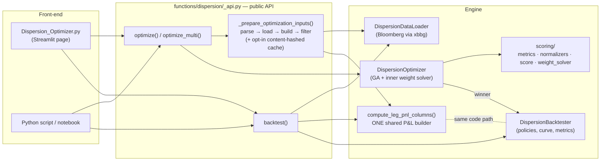
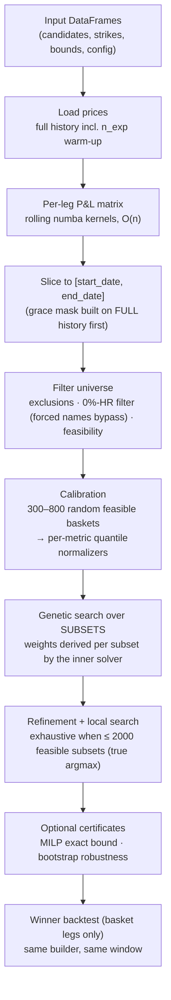

# Dispersion Engine — Architecture & Reference

Selection, weighting and backtesting of variance / vol-swap dispersion baskets
(mono-corridor and cross-corridor), driven either headless from Python or
through the Streamlit page. The page is a thin front-end: every computation
routes through `functions/dispersion/_api.py`.

---

## 1. Architecture



Both the optimizer's scored P&L matrix and the delivered backtest are produced
by the **same builder** (`compute_leg_pnl_columns`), so scored and delivered
results cannot drift apart.

### Naming convention

Names follow the **role**, never the asset class (the class is only the usual
case; the role never flips). The authoritative glossary lives at the top of
`_backtester.py`.

| Term | Usually | Role |
|---|---|---|
| **Variance Asset** → series `variance_px` | the index (`HSCEI Index`) | underlies the **cross leg** (index variance inside the stock's corridor); the traded name itself in mono mode |
| **Corridor Condition Asset** → series `corridor_px` | the stock (`005930 KP Equity`) | underlies the **mono leg**, defines the corridor for both legs, and is the **per-name key** (P&L column, forced tickers, vega) |
| `pnl_mono` / `pnl_cross` | — | the two sub-legs; **leg P&L = (mono − cross) × 100** |
| `Long Leg` / `Short Leg` | — | **basket** sides (short = sold legs, always subtracted); never mono/cross |

### Units

Public DataFrames carry percentages (`Strike Mono Var Swap (%)` = 21.4,
`Min/Max Weight` = 5.0); internal objects (`DispersionLeg`, constraints,
results) carry decimals. All conversions happen in `_api.py`, nowhere else.

---

## 2. The algorithm



### 2.1 P&L kernels

For each date, the rolling window takes the last `n_exp + 1` **valid**
observations; a day where the name did not trade emits NaN (never a stale
value). Two product kernels, both numba-compiled and O(n):

- `_rolling_pnl_volswap` — realized vol vs strike, capped at
  `local_cap × K`. The window's first daily return is excluded
  (`sq_logs[1:]`, historical convention — pinned by a test).
- `_rolling_pnl_corridor` — corridor variance swap: barriers set off the
  window's first corridor price; a return accrues iff both endpoints lie
  inside the corridor; payoff `((min(σ², (K·cap)²) − K²) · M/n_exp) / 2K`.

Cross-corridor composes them per leg: mono = kernel(stock, stock), cross =
kernel(index variance, stock corridor), leg = mono − cross. A leg whose
corridor price did not load is **dropped with a warning** (never silently
degraded to an index swap); a duplicate per-name key raises.

Both kernels are verified against naive loop-based reference implementations
at 1e-12 (`tests/test_kernel_reference.py`).

### 2.2 Missing-data policies

How a gap day (no observation for a name) enters the basket P&L — one
implementation shared by scoring and backtesting:

| Policy | Gap-day behaviour |
|---|---|
| `ADAPTIVE_REWEIGHT` (default) | the name's weight is redistributed to active names, day by day; with `reweight_grace_days = N > 0`, a gap ≤ N days keeps the weight allocated (contributes 0) before redistributing. The participation mask is built on **full history**, so a gap spanning the window start behaves identically in optimizer and backtester (`active_mask_with_grace`). |
| `FILL_ZERO` | the name contributes 0 that day (basket under-invested); all days kept |
| `DROP_INCOMPLETE_DAYS` | only days where every weighted name trades are kept |

### 2.3 Score function

For a candidate basket with net P&L series *p*:

```
score = Σ_m  w_m · Φ_m( metric_m(p) )        (weights re-normalized to Σ = 1)
```

- `metric_m` — a raw statistic of the series: `last_carry`, `mean_payoff`,
  `hit_ratio`, `min_payoff`, plus optional `max_drawdown`, `cvar_5`,
  `sharpe_payoff`, `weighted_strike` and (vega mode) `axe_book_cleaned`,
  `axe_package_recycled`. Each is a small class registered through
  `@register_metric` in `scoring/metrics.py`.
- `Φ_m` — the metric's **empirical quantile against a calibration sample**:
  before the search, 300 random feasible baskets (800 when a tail metric is
  active) are drawn with a mix of weight strategies (equal / QP-diversified /
  greedy-spread / Dirichlet) and their raw metrics fitted into per-metric
  `QuantileNormalizer`s. A score of 0.97 on a metric therefore reads as "beats
  97 % of random feasible baskets on that metric". Degenerate references
  (zero spread) raise instead of silently deactivating the metric.
- The calibration is cached and shared across configurations with the same
  (seed, sample size, active-extras) signature; RNG states are restored on
  reuse so any run remains bit-identical to a solo run.

### 2.4 Search

The genome is the **subset only**; weights are always derived from the subset
by a single deterministic rule (`_fitness`): the exact inner solver for
exact-path configurations (all-linear blends, min-payoff maximin via
LP/bisection, concave blends via SLSQP + deterministic sweep), a bounded
equal-weight projection otherwise. GA operators (selection, crossover,
mutation) act on subsets under the hard constraints (basket sizes, per-name
Min/Max weight, max net strike, bucket counts/weights, forced names, vega
caps). After the GA: elite refinement, then a local search that **enumerates
all feasible subsets exhaustively when there are ≤ 2000** (the returned
basket is then the true argmax, seed-independent); above that, multi-start
2-swap descent plus random restarts. Optional certificates: a MILP bound for
the min-payoff objective and a day-resampling bootstrap
(`robustness_check=True`).

### 2.5 Determinism & reproducibility

Same inputs + same seed ⇒ same basket, score and weights. Every run carries a
`scoring_signature`; `save_bundle_path=` writes a **run bundle** (P&L matrix
parquet + JSON of legs/constraints/weights/seed + the grace mask when active)
whose `replay()` reproduces the result exactly offline. Bundle format is
versioned (`run_bundle.BUNDLE_VERSION`); v1 bundles replay under the
semantics they were created with.

---

## 3. Module reference

### `functions/dispersion/_api.py` — public API (single conversion layer)

| Function | Role |
|---|---|
| `optimize(long_df, config, constraints, ...)` | full pipeline: prep → GA → winner backtest. Key options: `score_weights`, `seed`, `forced_tickers`, `bucket_constraints`, `vega`, `n_reference_samples`, `robustness_check`, `save_bundle_path`, `cache_prep` |
| `optimize_multi(..., configs=[...])` | N weight configurations on one data load + shared calibration; each row bit-equal to the corresponding solo run |
| `backtest(df, config, ...)` | standalone basket backtest (fixed weights) |
| `solve()` / `price()` | pricing entry points (separate desk workflow) |
| `_prepare_optimization_inputs()` | parse → load → build matrix → slice window → filter universe → feasibility → forced-index resolution; returns the prepared inputs |
| `_prepare_cached()` / `_PREP_CACHE` | opt-in single-slot cache of the prepared inputs, keyed by a content hash of every input (`cache_prep=True`) |
| `_build_pnl_matrix()` | thin wrapper over the shared builder (kept as the optimizer-side entry point) |

### `functions/dispersion/_backtester.py` — kernels, builder, backtester, loader

| Symbol | Role |
|---|---|
| `_rolling_pnl_volswap` / `_rolling_pnl_corridor` | numba rolling P&L kernels (§2.1) |
| `_vol_swap_window` / `_corridor_varswap_window` | single-window payoffs |
| `compute_leg_pnl_columns(variance_px, corridor_px, legs, cfg)` | **the** per-leg P&L builder used by both engines; drops cross legs with missing corridor prices (warn), raises on duplicate keys |
| `_leg_pnl_cross_corridor()` | one cross-corridor leg → `(pnl_mono, pnl_cross)` |
| `DispersionBacktester.run(variance_px, legs, weights, corridor_px, start_date, end_date)` | basket backtest: matrix → policy → curve bounded to `[start, end]`, per-leg and mono/cross breakdowns, active-name count |
| `_apply_fill_zero/_drop/_adaptive_policy` | the three gap-day policies (§2.2) |
| `DispersionDataLoader.load(basket)` | Bloomberg fetch (`variance_px`, `corridor_px`); infra failures raise |
| `SwapCalculator.compute()` | product dispatch for a single series |

### `functions/dispersion/_optimizer.py` — the search

| Symbol | Role |
|---|---|
| `DispersionOptimizer.run()` | calibration → GA loop → refinement/local search → packaging |
| `_fitness` / `_compute_net_pnl` / `_adaptive_net_pnl` | subset → weights → net P&L → score (policy-aware, `L − S`) |
| `_generate_reference_sample` / `_build_reference_sample` | calibration draws + normalizer fit; shared via `reference_cache` |
| `_exact_swap_local_search` | post-GA polish; exhaustive under 2000 feasible subsets |
| `_net_strike` / `_solver_strikes` | net-strike constraint (XC: mono − cross spread per leg) |
| `TUNING` (`_TuningConstants`) | every GA magic number, named and documented |

### `functions/dispersion/scoring/`

| File | Role |
|---|---|
| `metrics.py` | metric classes + `@register_metric` registry (extension point, §5) |
| `normalizers.py` | `QuantileNormalizer` (empirical CDF, strictly-less ties), z-score / min-max variants |
| `score.py` | `MetricWeights`, `ScoreFunction` (fit reference, score candidates) |
| `weight_solver.py` | inner solver: `WeightSolver` (LP / bisection / SLSQP / sweep, bucket & vega constraints), `adaptive_pnl` and `active_mask_with_grace` (canonical policy math, shared with the backtester), `SOLVER_TUNING`, `project_to_bounded_simplex` |
| `aggregators.py` | series aggregation helpers used by metrics |

### Others

| File | Role |
|---|---|
| `models.py` | dataclasses (`DispersionConfig`, `SwapConfig`, `DispersionLeg`, `OptimizationConstraints`, `BucketConstraint`, `VegaConfig`, `MissingDataPolicy`) and `BacktestResult` — including `per_stock()`, `per_stock_stats()`, `to_frames()`, `export()` |
| `run_bundle.py` | save / load / `replay()` of runs (§2.5) |
| `Dispersion_Optimizer.py` | the Streamlit page — input tables, widgets, charts; calls the API above and nothing else |
| `tests/` | 86 tests: kernel-vs-reference, engine-equality (sign, grace, window boundary), golden regressions, API pipeline (offline monkeypatched loader), bundles, exports |

---

## 4. Guarantees (test-pinned)

- **Kernels = the math**: both rolling kernels match naive reference
  implementations at 1e-12, NaN pattern included; the vol-swap first-return
  skip is pinned.
- **One builder**: optimizer matrix ≡ backtester matrix (same function).
- **Short = minus** in every mode; optimizer net equals the hand-computed
  `L − S` reference.
- **Grace symmetric**: optimizer and backtester produce the same adaptive
  curve on gapped data, window boundary included; `grace=0` is bit-identical
  to the historical behaviour.
- **Reproducible**: golden runs are bit-frozen; bundles replay exactly;
  shared calibration and prep caching provably do not alter results.
- **Fail-loud**: blank mono strike, duplicate name, Bloomberg failure,
  non-positive price → clear errors, never silent fallbacks.

---

## 5. Headless usage & extension

```python
from functions.dispersion._api import optimize, backtest, optimize_multi
from functions.dispersion.models import DispersionConfig, OptimizationConstraints

cfg  = DispersionConfig(cross_corridor=True, n_exp=252)
cons = OptimizationConstraints(min_stocks_long=5, max_stocks_long=10,
                               max_net_strike=0.29, time_limit_seconds=30)

result = optimize(long_df, cfg, cons,
                  score_weights={"mean_payoff": 0.5, "hit_ratio": 0.5},
                  seed=0, cache_prep=True)

result.long_basket                     # [(name, weight), ...]
result.backtest.per_stock("005930 KP Equity")   # net / mono / cross lines
result.backtest.per_stock_stats()               # tidy stats table
result.backtest.export("run.zip")               # curve + legs + stats, one file
```

Input DataFrames use the same columns the page shows. `optimize_multi` takes a
list of weight dicts and shares the data load and calibration across them.

**Adding a scoring metric**: implement a small class exposing `name` and
`compute(pnl, ctx) -> float` and register it with `@register_metric` in
`scoring/metrics.py`; it is normalized against the calibration sample and
blended like any built-in metric, and its name becomes valid in
`score_weights` (unknown names raise, listing the registry). `ScoreContext`
currently carries run-level extras (window length, annualisation, optional
benchmark series, net strike, axe figures); metrics that need per-name series
or basket weights require extending `ScoreContext` — the designated place for
that. Custom metrics ride the general search path; the exact-solver
guarantees apply to the built-in exact-path configurations only.
